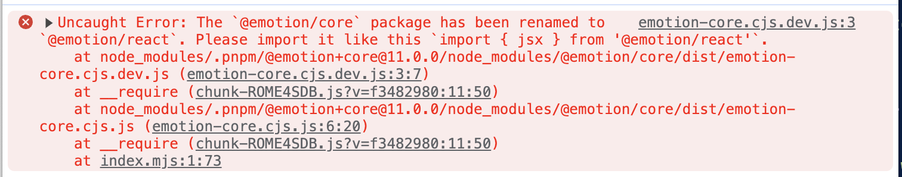
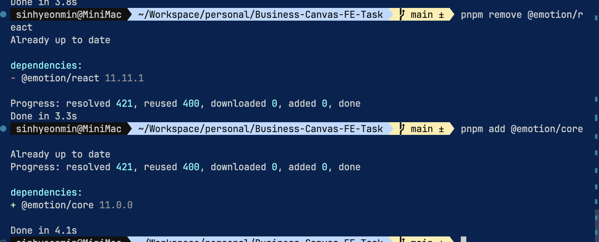

# error: Cannot find module 'typed-icons'



# Solution, 1 reinstall @emotion package

```bash

```bash
# goto node_modules/typed-design-system dir and run this command 
pnpm remove @emotion/react
pnpm install @emotion/core
```

-> failed

# Solution, 2 matched up @emotion/react version in package.json

```json
{
  "dependencies": {
    "@emotion/react": "^11.4.0",
    "@emotion/styled": "^11.3.0",
    "react": "^17.0.2",
    "react-dom": "^17.0.2",
    "typed-design-system": "^1.1.0"
  }
}
```

-> failed

# So, I just remove typed-icons package

```bash
pnpm remove typed-design-system
```

